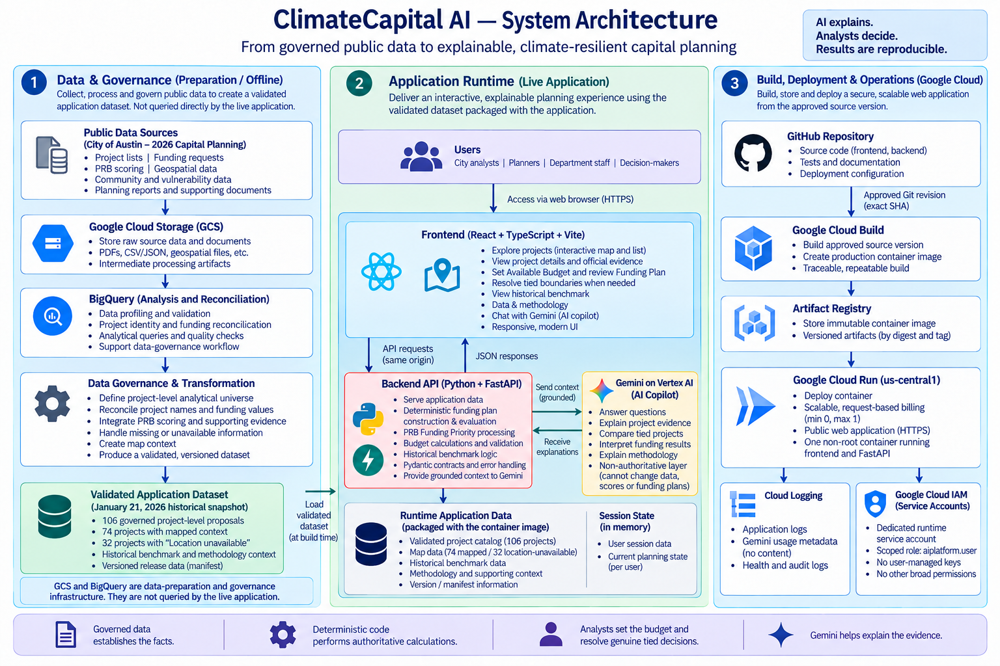

# ClimateCapital AI — Explainable Climate-Resilient Capital Planning for Cities

**ClimateCapital AI helps cities make transparent, evidence-based capital investment decisions under limited budgets by combining governed public data, deterministic analytics, interactive planning, and explainable AI.**

---

## What is ClimateCapital AI?

Cities often have more infrastructure needs than available capital funding, while the information required to evaluate those investments is fragmented across project lists, funding requests, scoring data, maps, reports, and other public records.

ClimateCapital AI brings this information into one governed decision-support environment.

The prototype uses **Austin, Texas and its 2026 capital-planning process** as a historical scenario. It includes **106 project-level proposals** across:

- Transportation
- Parks & Open Space
- Watershed
- Community Facilities

Users can explore projects, review evidence and funding requests, test different budgets, build reproducible Funding Plans, and use Gemini to better understand the results.

ClimateCapital AI is a historical decision-support prototype and does not represent an official City of Austin funding recommendation.

---

## How It Works

### 1. Explore projects
Browse and filter all 106 governed projects, inspect project evidence, and explore available geographic context through an interactive map.

**74 projects have supported map context**, while **32 remain fully available with an explicit “Location unavailable” state**.

### 2. Set an Available Budget
In **Funding Plan**, analysts can use the **$332M historical matched-cohort reference preset** or enter a custom budget.

### 3. Construct a reproducible Funding Plan
ClimateCapital AI automatically processes eligible projects from higher to lower official **PRB Funding Priority**, using complete project funding requests.

For the $332M reference scenario, the application produces:

- **18 projects selected**
- **$331,825,000 funded**
- **$175,000 remaining**

### 4. Keep human judgment explicit
If multiple projects have the same Funding Priority and the remaining budget cannot fund the entire tied group, ClimateCapital AI does not invent a hidden tie-breaker.

Instead, it presents an **Analyst Resolution**. The analyst reviews the tied projects and makes the decision before deterministic plan construction continues.

### 5. Use Gemini for explanation
**Gemini on Vertex AI** can explain project evidence, compare PRB scoring components, interpret Funding Plan results, explain tied boundaries, and clarify methodology.

Gemini does **not** change official scores, invent missing evidence, resolve tied funding decisions, or independently create the authoritative Funding Plan.

> **AI explains. Analysts decide. Results are reproducible.**

---

## System Architecture

ClimateCapital AI separates data governance, authoritative decision logic, and generative AI.

**Public data → GCS & BigQuery preparation → governed historical dataset → FastAPI deterministic services → React interface → Gemini explanation → Cloud Run**

Google Cloud Storage and BigQuery support **data preparation, reconciliation, and governance**. They are not queried directly by the live application.

The deployed application uses a validated, versioned dataset packaged with the release.

---

## Google Cloud & Tech Stack

| Area | Technology |
|---|---|
| Frontend | React, TypeScript, Vite |
| Mapping | Leaflet |
| Backend | Python, FastAPI |
| AI | Gemini 3.5 Flash on Vertex AI |
| Data preparation | BigQuery, Google Cloud Storage |
| Build | Google Cloud Build |
| Container registry | Artifact Registry |
| Deployment | Google Cloud Run |
| Security | IAM & Service Accounts |
| Observability | Cloud Logging |

---

## Responsible AI Design

ClimateCapital AI deliberately separates AI explanation from authoritative decision-making:

- **Governed data establishes the facts**
- **Deterministic code performs the calculations**
- **Analysts resolve genuinely ambiguous decisions**
- **Gemini explains the evidence**

This keeps the planning process transparent, reproducible, and auditable while still benefiting from generative AI.

---

## Historical Scenario

The prototype uses a **January 21, 2026 historical decision snapshot** so later recommendations or outcomes do not influence the analysis.

The purpose is to demonstrate how governed public data, deterministic analytics, human judgment, and explainable AI can work together in real-world municipal capital planning.

---

## Try It

**Explore a project → review its evidence → set an Available Budget → review the Funding Plan → resolve a tied boundary if one appears → ask Gemini to explain the result.**

**Live App:**  
https://climatecapital-ai-ksojl5xdtq-uc.a.run.app
